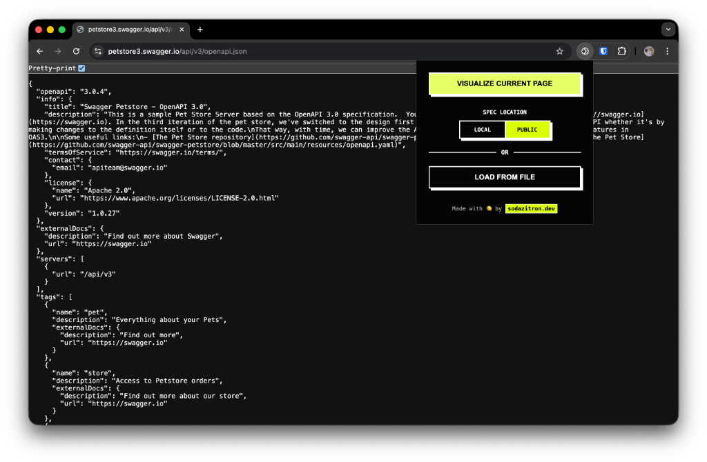

Heute habe ich eine einfache [Google Chrome Extension](https://chromewebstore.google.com/detail/enljnjkaijiflghcdkhgoimoeecifbdh) "vibe-gecodet". Es war mein erstes Mal, dass ich eine entwickelt habe, und ich habe nicht einmal die Dokumentation gelesen.

Ich habe das **Gemini CLI** und VS Code verwendet, um den **Scalar OpenAPI Viewer** zu erstellen, ein Tool, um OpenAPI/Swagger-Dateien wunderschön mit [Scalar](https://scalar.com/) zu rendern. Das Projekt ist Open Source: [Scalar Chrome Extension](https://github.com/kopfrechner/scalar-chrome-extension).

Das Problem war einfach: Ich stoße oft auf rohe OpenAPI-Spezifikationsdateien (JSON oder YAML) und habe keinen passenden Editor oder eine Swagger UI griffbereit. Ich wollte ein einfaches, privates Entwicklertool, um das zu lösen.



## Der Prozess

Ich begann mit einer vagen Idee und ließ die KI fahren. Ich habe keine Berechtigungen überprüft oder mich über Manifest V3 eingelesen; ich habe Gemini einfach gebeten, das Projekt zu scaffolden. Wir sind gegen Wände gelaufen, haben Dinge kaputt gemacht und sie wieder repariert. Das ist "Vibe Coding" für mich – schnelles Iterieren mit einem Assistenten, bis sich die Software richtig anfühlt. Dennoch überprüfe ich alle Änderungen und möchte ein Gefühl dafür bekommen, wie der Code unter der Haube funktioniert.

## Technische Hürden

Meine [Git History](https://github.com/kopfrechner/scalar-chrome-extension/commits/main/) zeigt genau, wo wir gestolpert sind.

### 1. Die Sandbox

Ich wollte die Scalar API Reference Bibliothek verwenden, also war mein erster Instinkt, einfach das JS von einem CDN zu laden. Chromes Manifest V3 hat das sofort blockiert. Die Content Security Policy ist bei Erweiterungsseiten sehr streng.

Um das zu umgehen, haben wir die Viewer-Logik auf eine "Sandboxing"-Seite (`viewer.html`) verschoben. Das isoliert die Skripte von den restlichen Privilegien der Extension, erlaubt ihnen aber auszuführen.

### 2. Der `localStorage` Absturz

Als das CDN funktionierte, stürzte Scalar trotzdem ab. Es ignoriert den Sandbox-Kontext und versucht, auf `window.localStorage` zuzugreifen, um Benutzereinstellungen (wie Light/Dark Mode) zu speichern. In einem null-origin Sandboxed Iframe wirft das einen `SecurityError`.

Wir mussten einen In-Memory-Mock programmieren, um es zum Schweigen zu bringen:

```javascript
// viewer.js
try {
  window.localStorage;
} catch (e) {
  // Mock localStorage to prevent SecurityError
  const store = {};
  Object.defineProperty(window, "localStorage", {
    value: {
      getItem: key => store[key] || null,
      setItem: (key, value) => {
        store[key] = String(value);
      },
      // ... rest of the mock
    },
    // ...
  });
}
```

### 3. Berechtigungsangst

Anfänglich habe ich um die `<all_urls>` Berechtigung gebeten, damit die Erweiterung auf jeder Seite funktioniert. Google erzeugt eine furchterregende Warnung für Benutzer, wenn man das tut.

Stattdessen bin ich auf `activeTab` gewechselt. Es gewährt nur Zugriff auf den _aktuellen_ Tab, wenn man explizit auf das Icon klickt. Es ist besser für die Privatsphäre und beschleunigt (hoffentlich) das Review.

## Die Web Store Erfahrung

Ich wollte dies einfach mit Leuten teilen, daher war ich genervt, eine **$5 Registrierungsgebühr** für den Chrome Web Store vorzufinden.

Der Einreichungsprozess ist mühsam. Google stellt _sehr viele_ Fragen zur Privatsphäre. Einfach für mich – ich sammle nichts ein – aber trotzdem eine lästige Pflicht.

Jetzt warte ich. Der Review-Prozess dauert anscheinend Wochen, und das Schlimmste ist der Lock-in. Man kann die Einreichung weder stoppen noch aktualisieren, sobald sie ausgelöst wurde. Ich habe ein Footer-Update bereitliegen, aber ich bin ausgesperrt, bis sie fertig sind.

## Gedanken

Es war ein spaßiges Experiment. Wir gingen von `git init` bis zur Einreichung im Google Chrome Store in exakt **161 Minuten** (etwa 2 Stunden 40 Minuten).

In einer Session gingen wir von null Wissen zu einer größtenteils automatisierten, voll funktionsfähigen Erweiterung mit CI/CD und einer Datenschutzrichtlinie.

Während ich auf Google warte, kannst du dir den Code schnappen oder ihn selbst aus dem [Repository](https://github.com/kopfrechner/scalar-chrome-extension) sideloaden.
